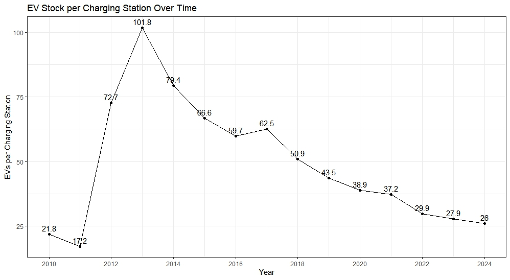

# Global Electric Vehicle Adoption

Our project analyzes trends in electric vehicle usage on a global scale. 

## Overview

We look at data from the early 2010s to 2025 to see how trends have changed in EV adoption. The main metrics we compared were Electric vehicle sales per year, electric vehicle stock/public charging station, and electric vehicle legislation per year. The goal is to see how trends are shifting for consumers in the global automotive industry since the growth of the electric vehicle market.

### Interesting Insight (Optional)

The graph shows how the ratio of total number of Electric Vehicles to charging stations changes over this period of 14 years. We can clearly see when electric vehicles became wildly popular around 2012-2014 as the vehicle/charger ratio shoots up really high. Observing the rest of the graph we see how investment is made in charger infrastructure, as the ratio steadily decreases. 

## Data Sources and Acknowledgements

Our data comes from the International Energy Agency, which is an intergovernmental organization focused on global energy management. The data is from their Electric Vehicle Outlook publication, which looks to identify changes in electric vehicles around the world. 

## Current Plan

We intend to use this data to explore current trends and learn about what is going on in electric vehicle usage around the world.

## Repo Structure

## Authors

Hojin Yoon and John Cho are both Sophmore students studying Data Science at Pennsylvania State University.
Any questions can be directed towards our emails hfy5167@psu.edu and jyc5937@psu.edu
